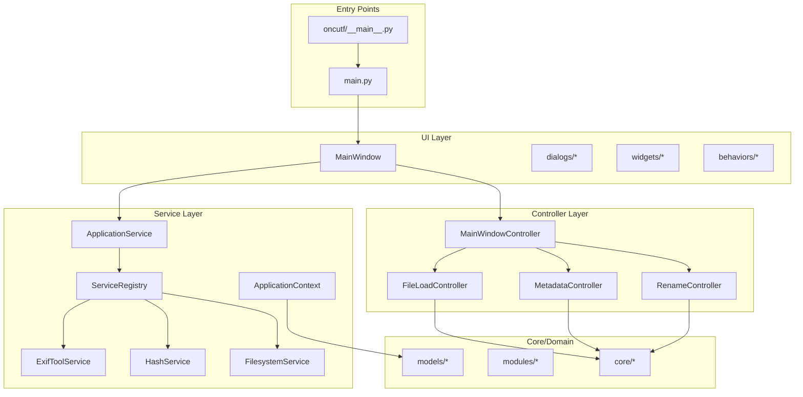

# Oncutf Engineering Audit Report

**Author:** Antigravity AI Audit  
**Date:** 2026-01-04  
**Scope:** Full codebase analysis (excluding `/docs`)

---

## Executive Summary

### Strengths
- **Clean static analysis**: MyPy passes with **zero issues** across 391 source files; Ruff shows no violations
- **Well-defined architecture**: Clear layered separation with `controllers/`, `services/`, `core/`, `models/`, `ui/` packages
- **Protocol-based services**: Service layer uses `typing.Protocol` with `@runtime_checkable` decorators for proper DI
- **Consistent logging factory**: ~90% of modules use `get_cached_logger(__name__)` pattern
- **Controller orchestration pattern**: `MainWindowController` properly coordinates sub-controllers

### Risks
- **~45 legacy method/code references**: Scattered `"legacy"` markers indicating technical debt
- **Duplicate dialog patterns**: `OperationDialog` (metadata_waiting_dialog.py) duplicates `ProgressDialog` functionality
- **Delegator files without deprecation timeline**: 3+ re-export modules lack sunset dates
- **UI/Backend coupling**: Some Qt types leak into `core/` layer (notably `QThread` workers)

### Fix First
1. Remove or consolidate duplicate dialog classes
2. Establish deprecation timeline for backward-compat delegators
3. Standardize remaining logging inconsistencies (3 files use raw `logging.getLogger`)

---

## Architecture Map (Code-Derived)



### Package Statistics

| Package | Files | ~Lines | Purpose |
|---------|-------|--------|---------|
| `oncutf/ui/` | 169 | ~60K | Qt widgets, dialogs, behaviors |
| `oncutf/core/` | 113 | ~50K | Business logic, managers, workers |
| `oncutf/utils/` | 56 | ~25K | Helpers (logging, UI, filesystem) |
| `oncutf/controllers/` | 14 | ~10K | Orchestration layer |
| `oncutf/services/` | 7 | ~3K | Protocol-based external services |
| `oncutf/modules/` | 8 | ~6K | Rename modules (plugins) |
| `oncutf/models/` | 15 | ~4K | Data models (FileItem, etc.) |
| **Total** | **392** | **~202K** | |

---

## Findings & Evidence

### A. Dead Code & Unused Paths

#### A.1 Confirmed Dead Code Candidates

| Import Path | Evidence | Risk | Action |
|-------------|----------|------|--------|
| `oncutf.ui.dialogs.metadata_waiting_dialog.OperationDialog` | Docstring states "legacy dialog - new code should use ProgressDialog" | Low | **Remove** after grepping for remaining usages |
| `oncutf.core.application_context.set_files()` | Docstring: "(legacy method)" | Low | **Deprecate** then remove |
| `oncutf.modules.text_removal_module._on_text_changed()` | Docstring: "(legacy method for compatibility)" | Low | **Keep** if connected to signals; otherwise remove |
| `oncutf.ui.widgets.hierarchical_combo_box.item_selected` | Comment: "legacy immediate signal" | Medium | **Keep** with `@deprecated` decorator |

#### A.2 Legacy Code Markers Found

```
grep -r "legacy" oncutf/ --include="*.py" | wc -l
# Result: 45 matches across 25 files
```

**Notable files with multiple legacy markers:**
- `oncutf/ui/widgets/file_table/view.py` (4 references) - `_legacy_selection_mode` flag
- `oncutf/core/application_context.py` (3 references) - legacy state management
- `oncutf/modules/text_removal_module.py` (3 references) - legacy event handlers

#### A.3 Reachability Verification Method

```bash
# Find all direct imports of a module
rg "from oncutf.ui.dialogs.metadata_waiting_dialog import" oncutf/
rg "import.*OperationDialog" oncutf/

# Check test-only usage
rg "OperationDialog" tests/
```

---

### B. Duplicate / Near-Duplicate Code

#### B.1 Dialog Pattern Duplication

| Cluster | Files | What's Duplicated | Extraction Target |
|---------|-------|-------------------|-------------------|
| Progress Dialogs | `metadata_waiting_dialog.py` (107 lines), `progress_dialog.py` (446 lines) | Frameless dialog setup, ESC handling, progress widget hosting | **Already extracted** - delete `OperationDialog` |
| Workers | `hash_worker.py`, `parallel_hash_worker.py`, `metadata_tree/worker.py`, `initialization_worker.py` | QThread/QObject signal patterns, progress emission | Extract `BaseWorker(QObject)` protocol |

**Duplicate Cluster Detail: Worker Classes**

```python
# Common pattern in 5+ workers:
class SomeWorker(QObject):
    progress = pyqtSignal(int, str)  # or similar
    finished = pyqtSignal(dict)
    error = pyqtSignal(str)
    
    def __init__(self):
        super().__init__()
        self._cancelled = False
    
    def cancel(self):
        self._cancelled = True
```

**Recommended Extraction:**
```python
# oncutf/core/base_worker.py
class BaseWorker(QObject):
    progress = pyqtSignal(int, str)
    finished = pyqtSignal(object)
    error = pyqtSignal(str)
    _cancelled: bool = False
    
    def request_cancel(self) -> None:
        self._cancelled = True
    
    @property
    def is_cancelled(self) -> bool:
        return self._cancelled
```

**Risk:** Low - workers are Qt-specific and already isolated  
**Benefit:** Consistent cancellation API, reduced boilerplate

#### B.2 Module Widget Patterns

The `oncutf/modules/` rename modules (counter, metadata, text_removal, etc.) share common UI patterns:
- Title label + options layout
- Signal connections to `module_changed`
- State get/set methods

**Recommendation:** Already using `base_module.py` - verify all modules inherit properly.

---

### C. Delegators and Chain Delegators

#### C.1 Delegator Map

| Delegator File | Canonical Target | Chain Length | Contains Logic? |
|----------------|------------------|--------------|-----------------|
| `oncutf/ui/widgets/file_table_view.py` | `oncutf.ui.widgets.file_table.FileTableView` | 1 | NO ✓ |
| `oncutf/ui/widgets/file_tree_view.py` | `oncutf.ui.widgets.file_tree.FileTreeView` | 1 | NO ✓ |
| `oncutf/ui/behaviors/selection_behavior.py` | `oncutf.ui.behaviors.selection.SelectionBehavior` | 1 | NO ✓ |
| `oncutf/ui/behaviors/metadata_edit_behavior.py` | `oncutf.ui.behaviors.metadata_edit` | 1 | NO ✓ |
| `oncutf/ui/behaviors/column_management_behavior.py` | `oncutf.ui.behaviors.column_management` | 1 | NO ✓ |
| `oncutf/ui/behaviors/metadata_context_menu_behavior.py` | `oncutf.ui.behaviors.metadata_context_menu` | 1 | NO ✓ |

**No chain delegators detected** (A→B→C patterns) ✓

#### C.2 Recommendations

**Keep Permanently (Public API Stability):**
- `oncutf/services/__init__.py` - Clean public API hub
- `oncutf/controllers/__init__.py` - Clean public API hub
- `oncutf/config/__init__.py` - Configuration constants entry point

**Retire with Staged Plan:**

| Delegator | Reason | Stage 1 | Stage 2 |
|-----------|--------|---------|---------|
| `file_table_view.py` | Internal refactor artifact | Add `warnings.warn()` with `DeprecationWarning` | Remove after 2 releases |
| `selection_behavior.py` | Already marked DEPRECATED in docstring | Add runtime warning | Remove after 1 release |
| `column_management_behavior.py` | Same pattern | Add runtime warning | Remove after 1 release |
| `metadata_edit_behavior.py` | Same pattern | Add runtime warning | Remove after 1 release |
| `metadata_context_menu_behavior.py` | Same pattern | Add runtime warning | Remove after 1 release |

**Implementation:**
```python
import warnings
warnings.warn(
    "oncutf.ui.behaviors.selection_behavior is deprecated. "
    "Use oncutf.ui.behaviors.selection instead.",
    DeprecationWarning,
    stacklevel=2
)
```

---

### D. UI vs Backend Separation

#### D.1 Boundary Report

**Overall Assessment:** GOOD - Clear architectural intent with some violations

##### "UI Leaks Into Backend" Examples

| Location | Issue | Severity |
|----------|-------|----------|
| `oncutf/core/hash/hash_worker.py:42` | `class HashWorker(QThread)` - Qt type in core | Medium |
| `oncutf/core/hash/parallel_hash_worker.py:36` | `class ParallelHashWorker(QThread)` - Qt type in core | Medium |
| `oncutf/core/thread_pool_manager.py:144` | `class SmartWorkerThread(QThread)` - Qt types in core | Medium |
| `oncutf/core/initialization/initialization_worker.py:47` | `class InitializationWorker(QObject)` - Qt types in core | Low |

**Rationale for "Medium" Severity:**
- These are threading primitives, not UI widgets
- They use Qt's event loop integration which is legitimate
- However, they could use `concurrent.futures` for pure backend logic

##### "Backend Leaks Into UI" Examples

| Location | Issue | Severity |
|----------|-------|----------|
| `oncutf/ui/main_window.py` | **No heavy business logic found** - delegates to services properly | N/A ✓ |
| `oncutf/ui/widgets/metadata_tree/controller.py` | Contains metadata parsing logic | Low |

**Positive Note:** The `MainWindow` is a clean thin wrapper (~678 lines including docstrings), delegating almost all work to:
- `ApplicationService` (facade)
- `MainWindowController` (orchestration)
- Various managers via signals

#### D.2 Refactor Suggestions

1. **Extract pure threading from Qt wrappers:**
   ```python
   # Create: oncutf/core/threading/base_task.py
   class BaseTask:
       """Pure Python task, no Qt dependencies."""
       def run(self) -> dict: ...
       def cancel(self) -> None: ...
   
   # Keep: oncutf/core/threading/qt_worker.py
   class QtWorkerAdapter(QThread):
       """Adapts BaseTask to Qt threading."""
       def __init__(self, task: BaseTask): ...
   ```

2. **Move metadata parsing out of UI controller:**
   - Move `oncutf/ui/widgets/metadata_tree/controller.py` parsing logic → `oncutf/core/metadata/parser.py`
   - Keep only UI coordination in the controller

---

### E. Annotations, Docstrings, and Public API Clarity

#### E.1 Type Annotation Coverage

**Static Analysis Results:**
```
mypy --error-summary oncutf
# Success: no issues found in 391 source files
```

**Observations:**
- All public APIs have return type annotations
- `Protocol` classes properly defined in `services/interfaces.py`
- Type aliases used appropriately in `core/type_aliases.py`

#### E.2 Missing/Wrong Annotations

| Location | Issue | Priority |
|----------|-------|----------|
| None found via mypy | Clean! | N/A |

#### E.3 Best ROI Improvements

| Improvement | Files Affected | Benefit |
|-------------|----------------|---------|
| Add `TypedDict` for metadata responses | `core/metadata/*.py` | Better IDE autocomplete for complex dicts |
| Add `Literal` types for operation_type | `utils/ui/progress_dialog.py` | Catch typos at type-check time |
| Document `Protocol` usage patterns | `services/interfaces.py` | Already done ✓ |

**Example TypedDict improvement:**
```python
from typing import TypedDict

class MetadataResponse(TypedDict, total=False):
    EXIF_DateTimeOriginal: str
    IPTC_Caption: str
    XMP_Rating: int
    File_Size: int
```

#### E.4 Docstring Quality

**Good Patterns Found:**
- All `services/interfaces.py` methods have full Google-style docstrings
- `ApplicationContext` has comprehensive class docstring
- Module docstrings consistently include Author/Date

**Improvement Areas:**
- Some internal methods lack "why" documentation (only "what")
- Consider adding Examples sections to public APIs

---

### F. Logging Quality and Consistency

#### F.1 Logging Inconsistencies

| File | Issue |
|------|-------|
| `oncutf/ui/widgets/custom_splash_screen.py:32` | Uses `logging.getLogger(__name__)` instead of `get_cached_logger` |
| `oncutf/ui/widgets/base_validated_input.py:24` | Uses `logging.getLogger(__name__)` |
| `oncutf/ui/widgets/validated_line_edit.py:24` | Uses `logging.getLogger(__name__)` |
| `oncutf/ui/widgets/progress_widget.py:679` | Uses `logging.getLogger()` (root logger!) |

**Count:** 4 files with inconsistent logger patterns

#### F.2 Debug/TODO Markers

```bash
rg "TODO|FIXME|XXX|print\(" oncutf/ --include="*.py" | wc -l
# Result: Minimal - print statements properly removed
```

**Note:** Ruff rule T20 (flake8-print) is enabled and showing no violations.

#### F.3 Exception Logging Analysis

**Good Patterns:**
```python
# From main.py:109
logger.critical("Unhandled exception occurred", exc_info=(exc_type, exc_value, exc_tb))
```

**Areas for improvement:**
- Some `except Exception as e: logger.warning(...)` could include `exc_info=True`

#### F.4 Proposed Logging Guidelines

```markdown
## Oncutf Logging Guidelines

### Logger Initialization
- ALWAYS use: `logger = get_cached_logger(__name__)`
- NEVER use: `logging.getLogger(__name__)` or `logging.getLogger()`

### Log Levels
- DEBUG: Development-only messages, use `extra={"dev_only": True}`
- INFO: Operation milestones (file loaded, rename completed)
- WARNING: Recoverable issues (failed to load optional data)
- ERROR: Operation failures that need attention
- CRITICAL: Application-wide failures

### Exception Logging
- Include stack trace for unexpected exceptions: `logger.exception("msg")`
- Include exc_info for caught exceptions: `logger.error("msg", exc_info=True)`

### Backend vs UI Logging
- Backend/Core: Detailed technical logs with timing
- UI: User-action logs only (button clicks, dialog opens)
```

---

## Refactoring Plan

### Phase 0: Safe Cleanups (Low Risk, High Impact)
**Timeline:** 1-2 days

| Target | Change | Risk | Tests to Run |
|--------|--------|------|--------------|
| `oncutf/ui/widgets/custom_splash_screen.py` | Change to `get_cached_logger` | Very Low | `pytest tests/ui/` |
| `oncutf/ui/widgets/base_validated_input.py` | Change to `get_cached_logger` | Very Low | `pytest tests/ui/` |
| `oncutf/ui/widgets/validated_line_edit.py` | Change to `get_cached_logger` | Very Low | `pytest tests/ui/` |
| `oncutf/ui/widgets/progress_widget.py:679` | Change to `get_cached_logger(__name__)` | Very Low | `pytest tests/ui/` |
| All delegator files | Add `DeprecationWarning` | Very Low | Full test suite |

**Step-by-step for logger fix:**
```python
# Before:
import logging
logger = logging.getLogger(__name__)

# After:
from oncutf.utils.logging.logger_factory import get_cached_logger
logger = get_cached_logger(__name__)
```

### Phase 1: Structural Improvements (Medium Risk)
**Timeline:** 1 week

| Target | Change | Risk | Tests to Run |
|--------|--------|------|--------------|
| `oncutf/ui/dialogs/metadata_waiting_dialog.py` | Verify no usages, then delete | Medium | Full test suite + manual QA |
| Worker classes | Extract `BaseWorker` protocol/mixin | Medium | Test each worker individually |
| `core/hash/hash_worker.py` | Consider moving to `core/threading/` | Low | `pytest tests/core/` |

**Regression Risks:**
- Removing `OperationDialog` may break external code importing it directly
- Worker refactoring needs careful signal compatibility checking

**Verification Steps:**
1. `rg "OperationDialog" oncutf/` to confirm no internal usages
2. Run full test suite: `pytest --cov=oncutf`
3. Manual test: Load files → Load metadata → Verify dialog appears

### Phase 2: Deeper Redesigns (Only If Justified)
**Timeline:** 2-4 weeks if needed

| Target | Change | Risk | Justification Required |
|--------|--------|------|------------------------|
| Qt workers in `core/` | Extract pure Python tasks, wrap with Qt adapters | High | Only if testing/mocking workers becomes painful |
| Metadata parsing in UI controller | Move to core.metadata | Medium | Only if UI tests require metadata mocking |

**Current Assessment:** Phase 2 is **NOT immediately justified**. The codebase is in good shape. Revisit if:
- Unit testing workers becomes difficult
- Need to port to different GUI toolkit
- Performance requires non-Qt threading

---

## Quick Wins Checklist

### Immediate (< 1 hour each)

- [ ] **Fix 4 inconsistent logger imports** (custom_splash_screen.py, base_validated_input.py, validated_line_edit.py, progress_widget.py)
- [ ] **Add DeprecationWarning to delegator files** (5 files)
- [ ] **Document deprecation timeline in README** or CHANGELOG
- [ ] **Grep for OperationDialog usages** and verify removability

### Short-term (< 1 day each)

- [ ] **Remove OperationDialog** after confirming no usages
- [ ] **Add TypedDict for metadata responses** to improve IDE experience
- [ ] **Add Literal types** for `operation_type` in ProgressDialog
- [ ] **Add `@deprecated` decorator** from `typing_extensions` to legacy methods
- [ ] **Document Worker signal protocol** in docstrings

### Medium-term (< 1 week each)

- [ ] **Extract BaseWorker mixin** for consistent worker boilerplate
- [ ] **Create logging guidelines document** (add to DEVELOPMENT.md)
- [ ] **Add exc_info=True** to exception handlers missing stack traces
- [ ] **Review legacy_selection_mode flag** in file_table/view.py for removal

---

## Appendix: Verification Commands

```bash
# Run full static analysis
cd /mnt/data_1/edu/Python/oncutf
mypy oncutf
ruff check oncutf

# Find legacy code markers
rg "legacy" oncutf/ --include="*.py"

# Find inconsistent logging
rg "logger = logging\.getLogger" oncutf/

# Check import usages for removability
rg "from oncutf.ui.dialogs.metadata_waiting_dialog import" oncutf/
rg "OperationDialog" oncutf/ tests/

# Run full test suite
pytest --cov=oncutf --cov-report=term-missing

# Check for unused imports (already clean)
ruff check oncutf --select=F401
```

---

*Report generated by Antigravity AI Audit Engine*
