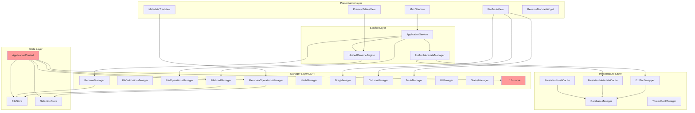
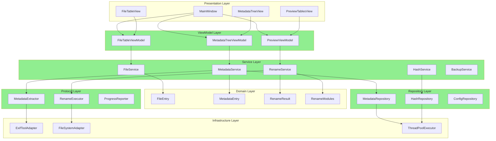
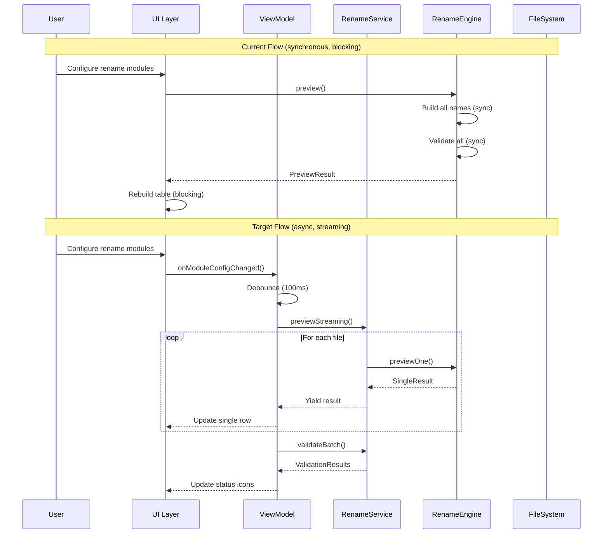
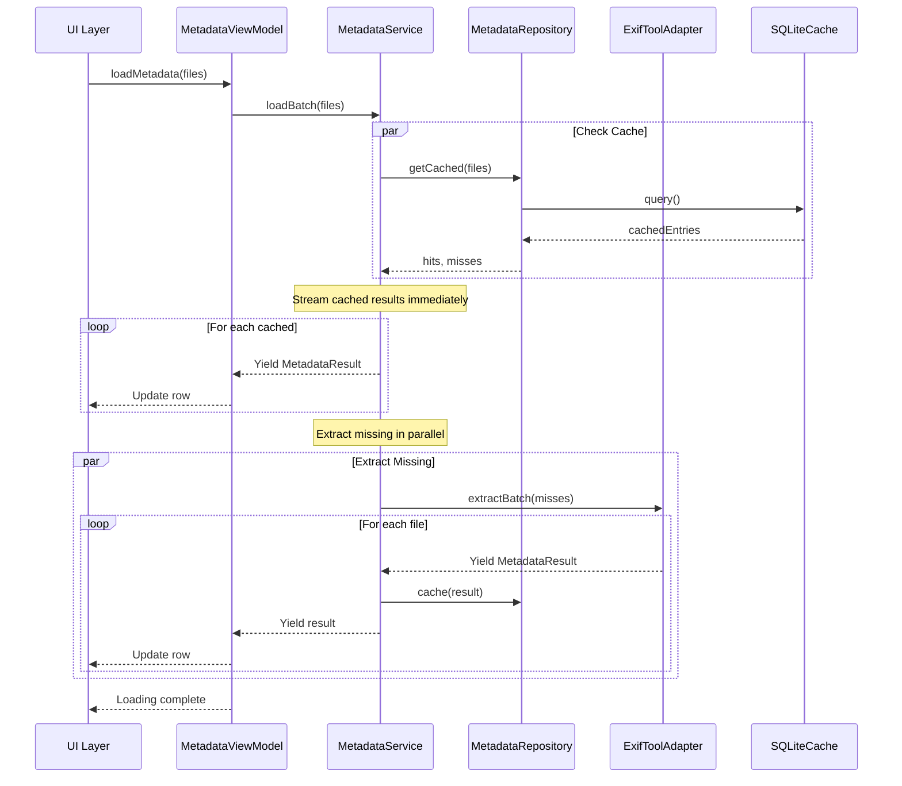

# OnCutF Comprehensive Refactoring & Optimization Plan

**Document Version:** 1.0  
**Date:** 2025-01-14  
**Author:** AI Architecture Analysis  
**Status:** Planning Phase

---

## Table of Contents

1. [Executive Overview](#1-executive-overview)
2. [Current Issues Analysis](#2-current-issues-analysis)
3. [High-Level Architecture Vision](#3-high-level-architecture-vision)
4. [Full Refactoring Plan (Phased)](#4-full-refactoring-plan-phased)
5. [Detailed Task Breakdown](#5-detailed-task-breakdown)
6. [Risk Assessment & Mitigation](#6-risk-assessment--mitigation)
7. [LLM Agent Recommendations](#7-llm-agent-recommendations)
8. [Architecture Diagrams](#8-architecture-diagrams)

---

## 1. Executive Overview

### 1.1 Project Summary

**OnCutF** is a PyQt5-based desktop application for advanced batch file renaming with EXIF/metadata support. The codebase demonstrates mature architectural patterns but has accumulated technical debt through organic growth.

### 1.2 Key Statistics

| Metric | Value | Assessment |
|--------|-------|------------|
| Total Python Files | ~150+ | Large codebase |
| Core Module Files | 60 | High complexity |
| Widget Files | 36 | UI-heavy |
| Utility Files | 53 | Well-organized |
| Largest File (LOC) | `metadata_tree_view.py` (3102) | Needs decomposition |
| Manager Classes | 30+ | Manager explosion |
| Average File Size | ~400 LOC | Acceptable |

### 1.3 Refactoring Goals

1. **Maintainability**: Reduce cognitive load through better separation of concerns
2. **Testability**: Enable unit testing without Qt event loop dependencies
3. **Performance**: Optimize metadata loading and UI responsiveness
4. **Extensibility**: Facilitate adding new rename modules and metadata sources
5. **Stability**: Reduce coupling between components to minimize regression risks

### 1.4 Guiding Principles

- **Incremental Changes**: No big-bang rewrites; each phase delivers value
- **Backward Compatibility**: Preserve existing user workflows and file formats
- **Test-First Approach**: Add tests before refactoring critical paths
- **Minimize Risk**: Prioritize reversible changes over irreversible ones

---

## 2. Current Issues Analysis

### 2.1 Architectural Debt

#### 2.1.1 Manager Explosion Pattern

The codebase relies on 30+ manager classes registered in `ApplicationContext`:

```
ApplicationContext (singleton)
├── FileStore
├── SelectionStore
├── FileLoadManager
├── MetadataOperationsManager
├── RenameManager
├── HashManager
├── BatchOperationsManager
├── DragManager
├── ColumnManager
├── TableManager
├── UIManager
├── StatusManager
├── ShortcutManager
├── SplitterManager
├── WindowConfigManager
├── DialogManager
├── ... (15+ more)
```

**Problems:**
- Unclear responsibility boundaries between managers
- Circular dependency risks (managers calling each other)
- Difficult to unit test managers in isolation
- Context acts as a service locator anti-pattern

#### 2.1.2 God Widget Classes

Several widget classes exceed 2000+ LOC with mixed responsibilities:

| Widget | LOC | Responsibilities |
|--------|-----|------------------|
| `file_table_view.py` | 2715 | Selection, drag-drop, column config, hover, context menus, keyboard |
| `metadata_tree_view.py` | 3102 | Tree display, editing, undo/redo, scroll memory, context menus |
| `main_window.py` | 900+ | Orchestration (delegated but still complex) |

**Problems:**
- Business logic mixed with UI concerns
- Difficult to test without full Qt setup
- High coupling to global state

#### 2.1.3 Inconsistent Layer Boundaries

```
┌─────────────────────────────────────────────────────────┐
│ Presentation Layer (widgets/)                           │
│   - Some widgets access databases directly              │
│   - Some widgets contain business logic                 │
│   - Inconsistent signal/slot patterns                   │
├─────────────────────────────────────────────────────────┤
│ Service Layer (core/application_service.py)             │
│   - Facade pattern partially implemented                │
│   - Some managers bypass service layer                  │
├─────────────────────────────────────────────────────────┤
│ Domain Layer (modules/, core/)                          │
│   - Rename modules are well-isolated                    │
│   - Metadata handling spread across multiple files      │
├─────────────────────────────────────────────────────────┤
│ Infrastructure Layer (core/, utils/)                    │
│   - Database access, caching, external tools            │
│   - Well-implemented but mixed with domain logic        │
└─────────────────────────────────────────────────────────┘
```

### 2.2 Performance Bottlenecks

#### 2.2.1 Metadata Loading

**Current Flow:**
```
User selects files → UnifiedMetadataManager → ExifToolWrapper (subprocess)
                                           → ParallelMetadataLoader
                                           → PersistentMetadataCache (SQLite)
                                           → StructuredMetadataManager
                                           → UI Update (blocking)
```

**Issues:**
- Sequential UI updates during batch loading
- No streaming/progressive updates for large file sets
- ExifTool subprocess health checks on main thread
- Cache invalidation strategy unclear

#### 2.2.2 Preview Generation

**Current Flow:**
```
Module config change → All modules rebuild fragments
                    → UnifiedRenameEngine.preview()
                    → Validation (sync)
                    → UI Table update (blocking)
```

**Issues:**
- Full recalculation on any module change
- No debouncing for rapid consecutive changes
- Validation runs synchronously
- Preview tables rebuilt from scratch each time

#### 2.2.3 UI Responsiveness

**Identified Hotspots:**
- Drag-drop operations with 1000+ files
- Column resize with many visible rows
- Metadata tree expansion with deep hierarchies
- Context menu generation with many items

### 2.3 Code Quality Issues

#### 2.3.1 Duplication

| Area | Examples |
|------|----------|
| File validation | `filename_validator.py`, `validate_filename_text.py`, inline checks |
| Error handling | Inconsistent try/except patterns across managers |
| Signal connections | Similar connection boilerplate in multiple widgets |
| Configuration access | Direct `config.X` access scattered throughout |

#### 2.3.2 Missing Abstractions

- No Protocol/ABC for metadata sources (currently only ExifTool)
- No interface for rename conflict resolution strategies
- Drag-drop logic partially in widgets, partially in managers
- Progress reporting inconsistent across async operations

#### 2.3.3 Type Safety Gaps

- Mixed use of `Optional[X]` and `X | None` syntax
- Some manager methods lack type hints
- `Any` type used in several generic callbacks
- Dict-based data structures where dataclasses would help

### 2.4 Testing Infrastructure

**Current State:**
- pytest configured with markers (unit, integration, gui, exiftool, slow)
- Some unit tests exist but coverage unclear
- GUI tests require ExifTool and file system access
- No mocking infrastructure for Qt components

**Gaps:**
- No integration tests for full rename workflow
- No performance regression tests
- No snapshot tests for UI state

---

## 3. High-Level Architecture Vision

### 3.1 Target Architecture

```
┌─────────────────────────────────────────────────────────────────────┐
│                     Presentation Layer                               │
│  ┌─────────────┐  ┌─────────────┐  ┌─────────────┐  ┌────────────┐  │
│  │ MainWindow  │  │ FileTable   │  │ MetadataView│  │ PreviewView│  │
│  │ Controller  │  │ Controller  │  │ Controller  │  │ Controller │  │
│  └──────┬──────┘  └──────┬──────┘  └──────┬──────┘  └─────┬──────┘  │
│         │                │                │                │         │
│  ┌──────┴────────────────┴────────────────┴────────────────┴──────┐  │
│  │                    ViewModel / State Layer                      │  │
│  │  (Reactive state management with observable properties)         │  │
│  └─────────────────────────────┬───────────────────────────────────┘  │
├────────────────────────────────┼────────────────────────────────────┤
│                     Service Layer                                    │
│  ┌──────────────────┐  ┌──────────────────┐  ┌────────────────────┐  │
│  │ FileService      │  │ MetadataService  │  │ RenameService      │  │
│  │ - load/validate  │  │ - extract/cache  │  │ - preview/execute  │  │
│  └────────┬─────────┘  └────────┬─────────┘  └──────────┬─────────┘  │
│           │                     │                       │            │
│  ┌────────┴─────────────────────┴───────────────────────┴─────────┐  │
│  │                    Domain Layer                                 │  │
│  │  ┌──────────────┐  ┌──────────────┐  ┌────────────────────────┐ │  │
│  │  │ RenameModule │  │ FileEntity   │  │ MetadataEntity         │ │  │
│  │  │ (Protocol)   │  │ (dataclass)  │  │ (dataclass)            │ │  │
│  │  └──────────────┘  └──────────────┘  └────────────────────────┘ │  │
│  └─────────────────────────────────────────────────────────────────┘  │
├───────────────────────────────────────────────────────────────────────┤
│                     Infrastructure Layer                              │
│  ┌─────────────┐  ┌─────────────┐  ┌─────────────┐  ┌─────────────┐  │
│  │ ExifTool    │  │ SQLite      │  │ FileSystem  │  │ ThreadPool  │  │
│  │ Adapter     │  │ Repository  │  │ Adapter     │  │ Executor    │  │
│  └─────────────┘  └─────────────┘  └─────────────┘  └─────────────┘  │
└───────────────────────────────────────────────────────────────────────┘
```

### 3.2 Key Architecture Decisions

#### 3.2.1 Adopt MVVM-like Pattern for Complex Widgets

**Rationale:** Separate presentation logic from UI widgets to enable testing and reduce widget complexity.

**Implementation:**
- Extract ViewModels for FileTableView, MetadataTreeView, PreviewTablesView
- ViewModels expose observable properties (PyQt signals as observables)
- Widgets bind to ViewModel properties, not domain objects directly

#### 3.2.2 Consolidate Managers into Cohesive Services

**Current:**
```
FileLoadManager + FileValidationManager + FileOperationsManager + FileStore
```

**Target:**
```
FileService (facade)
├── FileRepository (data access)
├── FileValidator (validation rules)
└── FileOperations (execute operations)
```

#### 3.2.3 Introduce Repository Pattern for Persistence

**Rationale:** Abstract database access behind repositories to enable testing with in-memory implementations.

**Targets:**
- `MetadataRepository` (wraps `persistent_metadata_cache.py`)
- `HashRepository` (wraps `persistent_hash_cache.py`)
- `ConfigRepository` (wraps `window_config_manager.py`)

#### 3.2.4 Define Protocols for External Dependencies

**Rationale:** Enable testing with mock implementations and future extensibility.

**Protocols:**
- `MetadataExtractor` (currently only ExifTool)
- `RenameExecutor` (currently direct filesystem operations)
- `ProgressReporter` (standardize progress reporting)

### 3.3 Module Dependency Rules

```
┌─────────────────────────────────────────────────────────────────┐
│ Layer Dependency Rules:                                         │
│                                                                 │
│ 1. Presentation → Service (allowed)                            │
│ 2. Service → Domain (allowed)                                  │
│ 3. Service → Infrastructure (allowed)                          │
│ 4. Domain → Infrastructure (NOT allowed)                       │
│ 5. Infrastructure → Service (NOT allowed)                      │
│ 6. Presentation → Domain (read-only, through ViewModels)       │
│ 7. Horizontal dependencies within layer (minimize)             │
└─────────────────────────────────────────────────────────────────┘
```

---

## 4. Full Refactoring Plan (Phased)

### Phase 0: Foundation & Preparation (2-3 weeks)

**Goal:** Establish testing infrastructure and documentation baseline without changing production code.

| Step | Task | Priority | Effort |
|------|------|----------|--------|
| 0.1 | Create comprehensive architecture documentation | High | 3d |
| 0.2 | Set up code coverage reporting (pytest-cov) | High | 1d |
| 0.3 | Create mock infrastructure for Qt components | High | 3d |
| 0.4 | Document all public APIs with docstrings | Medium | 5d |
| 0.5 | Create integration test skeleton for rename workflow | High | 2d |
| 0.6 | Establish performance baseline benchmarks | Medium | 2d |

**Deliverables:**
- Test coverage report infrastructure
- Mock classes for QApplication, QMainWindow, QTableView
- Performance benchmark suite
- Updated `docs/architecture/` with current state

---

### Phase 1: Domain Model Hardening (3-4 weeks)

**Goal:** Strengthen the domain layer with proper dataclasses, protocols, and validation.

| Step | Task | Priority | Effort |
|------|------|----------|--------|
| 1.1 | Create `models/file_entry.py` dataclass | High | 2d |
| 1.2 | Create `models/metadata_entry.py` dataclass (consolidate) | High | 2d |
| 1.3 | Create `models/rename_result.py` dataclass | High | 1d |
| 1.4 | Define `protocols/metadata_extractor.py` | High | 1d |
| 1.5 | Define `protocols/rename_executor.py` | High | 1d |
| 1.6 | Define `protocols/progress_reporter.py` | Medium | 1d |
| 1.7 | Refactor `ExifToolWrapper` to implement protocol | High | 3d |
| 1.8 | Add comprehensive type hints to all models | Medium | 3d |
| 1.9 | Write unit tests for all models | High | 3d |
| 1.10 | Migrate existing code to use new models (gradual) | High | 5d |

**Deliverables:**
- `models/` package with typed dataclasses
- `protocols/` package with ABC/Protocol definitions
- 90%+ test coverage on models

---

### Phase 2: Service Layer Consolidation (4-5 weeks)

**Goal:** Reduce manager explosion by consolidating into cohesive services.

| Step | Task | Priority | Effort |
|------|------|----------|--------|
| 2.1 | Create `services/file_service.py` (consolidate 4 managers) | High | 5d |
| 2.2 | Create `services/metadata_service.py` (consolidate 3 managers) | High | 5d |
| 2.3 | Create `services/rename_service.py` (wrap engine + managers) | High | 5d |
| 2.4 | Create `services/hash_service.py` (consolidate hash managers) | Medium | 3d |
| 2.5 | Create `services/backup_service.py` (wrap backup manager) | Medium | 2d |
| 2.6 | Refactor `ApplicationService` to use new services | High | 3d |
| 2.7 | Deprecate old managers with warnings | Medium | 2d |
| 2.8 | Update all call sites to use services | High | 5d |
| 2.9 | Write integration tests for services | High | 4d |
| 2.10 | Remove deprecated managers | Low | 2d |

**Manager Consolidation Map:**

```
NEW SERVICE           REPLACES
─────────────────────────────────────────────────────────
FileService         ← FileLoadManager
                    ← FileValidationManager  
                    ← FileOperationsManager
                    ← FileStore

MetadataService     ← UnifiedMetadataManager
                    ← StructuredMetadataManager
                    ← MetadataOperationsManager
                    ← MetadataStagingManager

RenameService       ← UnifiedRenameEngine
                    ← RenameManager
                    ← PreviewManager
                    ← RenameHistoryManager

HashService         ← HashManager
                    ← HashOperationsManager
                    ← PersistentHashCache

BackupService       ← BackupManager
                    ← DatabaseManager
```

**Deliverables:**
- `services/` package with 5 consolidated services
- Deprecation notices on old managers
- Integration test suite for services

---

### Phase 3: Widget Decomposition (4-5 weeks)

**Goal:** Extract ViewModels and decompose large widgets into smaller, focused components.

| Step | Task | Priority | Effort |
|------|------|----------|--------|
| 3.1 | Create `viewmodels/file_table_viewmodel.py` | High | 4d |
| 3.2 | Extract selection logic from FileTableView | High | 3d |
| 3.3 | Extract drag-drop logic into reusable component | High | 3d |
| 3.4 | Create `viewmodels/metadata_tree_viewmodel.py` | High | 4d |
| 3.5 | Extract tree editing logic from MetadataTreeView | High | 3d |
| 3.6 | Extract scroll memory logic into utility | Medium | 2d |
| 3.7 | Create `viewmodels/preview_viewmodel.py` | Medium | 3d |
| 3.8 | Refactor PreviewTablesView to use ViewModel | Medium | 3d |
| 3.9 | Extract common delegate patterns into base classes | Medium | 3d |
| 3.10 | Write unit tests for ViewModels (no Qt required) | High | 5d |

**Widget Decomposition Strategy:**

```
FileTableView (2715 LOC)
├── FileTableViewModel (logic, state, signals)
├── FileTableSelectionMixin (selection handling)
├── FileTableDragDropMixin (drag-drop logic)
├── FileTableContextMenuBuilder (context menus)
└── FileTableView (pure rendering, ~500 LOC)

MetadataTreeView (3102 LOC)
├── MetadataTreeViewModel (logic, state, signals)
├── MetadataTreeEditController (edit operations)
├── MetadataTreeScrollMemory (scroll position persistence)
├── MetadataTreeContextMenuBuilder (context menus)
└── MetadataTreeView (pure rendering, ~600 LOC)
```

**Deliverables:**
- `viewmodels/` package with 3+ ViewModels
- Reduced widget files (target: <800 LOC each)
- Unit tests for ViewModels

---

### Phase 4: Infrastructure & Performance (3-4 weeks)

**Goal:** Optimize critical paths and introduce repository pattern.

| Step | Task | Priority | Effort |
|------|------|----------|--------|
| 4.1 | Create `repositories/metadata_repository.py` | High | 3d |
| 4.2 | Create `repositories/hash_repository.py` | Medium | 2d |
| 4.3 | Create `repositories/config_repository.py` | Medium | 2d |
| 4.4 | Implement streaming metadata updates | High | 4d |
| 4.5 | Add debouncing to preview generation | High | 2d |
| 4.6 | Implement virtual scrolling for large tables | Medium | 5d |
| 4.7 | Optimize drag-drop for 1000+ files | Medium | 3d |
| 4.8 | Add caching layer for rename preview results | Medium | 3d |
| 4.9 | Profile and optimize ExifTool batch operations | Medium | 3d |
| 4.10 | Write performance regression tests | High | 3d |

**Performance Optimization Targets:**

| Operation | Current | Target | Strategy |
|-----------|---------|--------|----------|
| Load 1000 files | ~3s | <1s | Async + streaming UI updates |
| Preview 500 files | ~500ms | <100ms | Debounce + incremental updates |
| Metadata for 100 files | ~2s | <500ms | Parallel loading + warm cache |
| Drag-drop 500 files | ~1s lag | <100ms | Virtualized drag proxy |

**Deliverables:**
- `repositories/` package with 3 repositories
- Performance improvements meeting targets
- Performance regression test suite

---

### Phase 5: Testing & Quality (2-3 weeks)

**Goal:** Achieve comprehensive test coverage and code quality.

| Step | Task | Priority | Effort |
|------|------|----------|--------|
| 5.1 | Achieve 80% coverage on services layer | High | 4d |
| 5.2 | Achieve 90% coverage on models/domain | High | 3d |
| 5.3 | Add snapshot tests for critical UI states | Medium | 3d |
| 5.4 | Add end-to-end tests for rename workflow | High | 4d |
| 5.5 | Fix all mypy strict mode errors | Medium | 3d |
| 5.6 | Fix all ruff linting errors | Low | 2d |
| 5.7 | Update CI pipeline with quality gates | Medium | 2d |

**Deliverables:**
- Test coverage report showing 80%+ overall
- CI pipeline with coverage gates
- Clean mypy/ruff output

---

### Phase 6: Documentation & Polish (2 weeks)

**Goal:** Finalize documentation and prepare for future development.

| Step | Task | Priority | Effort |
|------|------|----------|--------|
| 6.1 | Update all module docstrings | High | 3d |
| 6.2 | Create developer onboarding guide | High | 2d |
| 6.3 | Document new architecture with diagrams | High | 2d |
| 6.4 | Create migration guide from old managers | Medium | 1d |
| 6.5 | Update README with architecture overview | Medium | 1d |
| 6.6 | Create CONTRIBUTING.md with conventions | Medium | 1d |

**Deliverables:**
- Comprehensive developer documentation
- Architecture diagrams (Mermaid)
- Onboarding guide

---

## 5. Detailed Task Breakdown

### 5.1 Phase 1 Deep Dive: Domain Models

#### Task 1.1: Create `models/file_entry.py`

**Current State:**
Files are represented inconsistently across the codebase:
- `FileStore` uses dict-based entries
- `FileTableView` expects specific keys
- Validation scattered across multiple files

**Target Implementation:**

```python
# models/file_entry.py
from dataclasses import dataclass, field
from pathlib import Path
from enum import Enum
from typing import Any

class FileStatus(Enum):
    """File status in the application workflow."""
    PENDING = "pending"
    LOADED = "loaded"
    VALIDATED = "validated"
    RENAMED = "renamed"
    ERROR = "error"

@dataclass(frozen=True)
class FileEntry:
    """
    Immutable representation of a file in the application.
    
    Attributes:
        path: Absolute path to the file
        original_name: Original filename (basename)
        size_bytes: File size in bytes
        modified_time: Last modification timestamp (Unix)
        metadata_hash: Hash for cache invalidation
        status: Current status in workflow
        error_message: Error details if status is ERROR
    """
    path: Path
    original_name: str
    size_bytes: int
    modified_time: float
    metadata_hash: str | None = None
    status: FileStatus = FileStatus.PENDING
    error_message: str | None = None
    
    @property
    def extension(self) -> str:
        """Get file extension including dot."""
        return self.path.suffix
    
    @property
    def stem(self) -> str:
        """Get filename without extension."""
        return self.path.stem
    
    @property
    def parent(self) -> Path:
        """Get parent directory path."""
        return self.path.parent
    
    def with_status(self, status: FileStatus, error: str | None = None) -> "FileEntry":
        """Create new entry with updated status."""
        return FileEntry(
            path=self.path,
            original_name=self.original_name,
            size_bytes=self.size_bytes,
            modified_time=self.modified_time,
            metadata_hash=self.metadata_hash,
            status=status,
            error_message=error,
        )
```

**Migration Strategy:**
1. Create new dataclass alongside existing dict-based approach
2. Add factory methods to convert from/to dict format
3. Gradually update call sites to use new dataclass
4. Deprecate dict-based access

#### Task 1.4: Define `protocols/metadata_extractor.py`

**Current State:**
Only `ExifToolWrapper` exists, with direct coupling throughout the codebase.

**Target Implementation:**

```python
# protocols/metadata_extractor.py
from typing import Protocol, runtime_checkable
from collections.abc import Iterator
from dataclasses import dataclass
from pathlib import Path

@dataclass
class MetadataResult:
    """Result of metadata extraction for a single file."""
    path: Path
    success: bool
    metadata: dict[str, Any] | None = None
    error_message: str | None = None
    extraction_time_ms: float = 0.0

@runtime_checkable
class MetadataExtractor(Protocol):
    """
    Protocol for metadata extraction implementations.
    
    Implementations must support both single-file and batch operations.
    """
    
    def extract_single(self, path: Path) -> MetadataResult:
        """Extract metadata from a single file."""
        ...
    
    def extract_batch(
        self, 
        paths: list[Path],
        progress_callback: Callable[[int, int], None] | None = None
    ) -> Iterator[MetadataResult]:
        """
        Extract metadata from multiple files.
        
        Yields results as they become available for streaming UI updates.
        Progress callback receives (completed, total) counts.
        """
        ...
    
    def is_available(self) -> bool:
        """Check if the extractor is available and functional."""
        ...
    
    def supported_extensions(self) -> frozenset[str]:
        """Return set of supported file extensions (with dots)."""
        ...
```

**Benefits:**
- Enables mock implementations for testing
- Allows future alternative extractors (e.g., pure Python, cloud API)
- Documents expected interface clearly

---

### 5.2 Phase 2 Deep Dive: Service Consolidation

#### Task 2.1: Create `services/file_service.py`

**Managers to Consolidate:**
- `FileLoadManager`: Loading files from filesystem
- `FileValidationManager`: Validating file entries
- `FileOperationsManager`: File operations (copy, move, delete)
- `FileStore`: In-memory file storage

**Target Implementation:**

```python
# services/file_service.py
from dataclasses import dataclass
from pathlib import Path
from typing import Iterator

from models.file_entry import FileEntry, FileStatus
from protocols.progress_reporter import ProgressReporter

@dataclass
class LoadResult:
    """Result of file loading operation."""
    loaded: list[FileEntry]
    skipped: list[tuple[Path, str]]  # (path, reason)
    errors: list[tuple[Path, str]]  # (path, error_message)

class FileService:
    """
    Unified service for file operations.
    
    Consolidates file loading, validation, and storage into a single
    cohesive service with clear responsibility boundaries.
    """
    
    def __init__(
        self,
        allowed_extensions: frozenset[str] | None = None,
        max_files: int = 10000,
    ):
        self._files: dict[Path, FileEntry] = {}
        self._allowed_extensions = allowed_extensions
        self._max_files = max_files
        
    def load_files(
        self,
        paths: list[Path],
        progress: ProgressReporter | None = None,
    ) -> LoadResult:
        """
        Load files from filesystem paths.
        
        Handles directories recursively and validates extensions.
        """
        ...
    
    def load_files_streaming(
        self,
        paths: list[Path],
    ) -> Iterator[FileEntry]:
        """
        Load files with streaming results.
        
        Yields entries as they are loaded for progressive UI updates.
        """
        ...
    
    def get_file(self, path: Path) -> FileEntry | None:
        """Get a loaded file by path."""
        return self._files.get(path)
    
    def get_all_files(self) -> list[FileEntry]:
        """Get all loaded files."""
        return list(self._files.values())
    
    def get_selected_files(self, paths: list[Path]) -> list[FileEntry]:
        """Get files matching the given paths."""
        return [
            self._files[p] for p in paths 
            if p in self._files
        ]
    
    def clear(self) -> None:
        """Clear all loaded files."""
        self._files.clear()
    
    def remove_files(self, paths: list[Path]) -> int:
        """Remove files from the service. Returns count removed."""
        count = 0
        for path in paths:
            if path in self._files:
                del self._files[path]
                count += 1
        return count
    
    def validate_file(self, entry: FileEntry) -> tuple[bool, str | None]:
        """
        Validate a single file entry.
        
        Returns (is_valid, error_message).
        """
        ...
    
    def validate_all(self) -> dict[Path, str]:
        """
        Validate all loaded files.
        
        Returns dict of path -> error_message for invalid files.
        """
        ...
```

**Migration Strategy:**
1. Create FileService with delegating implementations
2. Update ApplicationService to use FileService
3. Add deprecation warnings to old managers
4. Update remaining call sites
5. Remove old managers after transition period

---

### 5.3 Phase 3 Deep Dive: Widget Decomposition

#### Task 3.1: Create `viewmodels/file_table_viewmodel.py`

**Extract from `FileTableView`:**
- Selection state management
- Sort/filter state
- Column visibility configuration
- Hover state tracking
- Context menu action enablement

**Target Implementation:**

```python
# viewmodels/file_table_viewmodel.py
from dataclasses import dataclass, field
from pathlib import Path
from typing import Any

from core.pyqt_imports import QObject, pyqtSignal

@dataclass
class ColumnConfig:
    """Configuration for a table column."""
    key: str
    label: str
    width: int
    visible: bool = True
    sortable: bool = True
    resizable: bool = True

@dataclass  
class SelectionState:
    """Current selection state."""
    selected_paths: frozenset[Path] = field(default_factory=frozenset)
    anchor_path: Path | None = None
    focus_path: Path | None = None

class FileTableViewModel(QObject):
    """
    ViewModel for FileTableView.
    
    Manages state and logic, exposing changes through signals.
    The view binds to these signals for updates.
    """
    
    # State change signals
    files_changed = pyqtSignal()  # File list updated
    selection_changed = pyqtSignal(object)  # SelectionState
    sort_changed = pyqtSignal(str, bool)  # column_key, ascending
    filter_changed = pyqtSignal(str)  # filter_text
    columns_changed = pyqtSignal()  # Column config changed
    hover_changed = pyqtSignal(object)  # Path | None
    
    # Action availability signals
    actions_changed = pyqtSignal(dict)  # action_name -> enabled
    
    def __init__(self, file_service: "FileService", parent=None):
        super().__init__(parent)
        self._file_service = file_service
        self._selection = SelectionState()
        self._columns: list[ColumnConfig] = []
        self._sort_column: str | None = None
        self._sort_ascending: bool = True
        self._filter_text: str = ""
        self._hover_path: Path | None = None
        
    # Selection management
    def select_files(self, paths: list[Path], extend: bool = False) -> None:
        """Select files, optionally extending current selection."""
        if extend:
            new_selected = self._selection.selected_paths | set(paths)
        else:
            new_selected = frozenset(paths)
        
        self._selection = SelectionState(
            selected_paths=new_selected,
            anchor_path=paths[0] if paths else None,
            focus_path=paths[-1] if paths else None,
        )
        self.selection_changed.emit(self._selection)
        self._update_action_availability()
    
    def select_range(self, start: Path, end: Path) -> None:
        """Select range of files between start and end."""
        ...
    
    def clear_selection(self) -> None:
        """Clear all selection."""
        self._selection = SelectionState()
        self.selection_changed.emit(self._selection)
        self._update_action_availability()
    
    # Sort/Filter
    def set_sort(self, column_key: str, ascending: bool = True) -> None:
        """Set sort column and direction."""
        self._sort_column = column_key
        self._sort_ascending = ascending
        self.sort_changed.emit(column_key, ascending)
    
    def set_filter(self, text: str) -> None:
        """Set filter text."""
        self._filter_text = text
        self.filter_changed.emit(text)
    
    # Column management
    def set_column_visible(self, key: str, visible: bool) -> None:
        """Toggle column visibility."""
        for col in self._columns:
            if col.key == key:
                col.visible = visible
                break
        self.columns_changed.emit()
    
    def set_column_width(self, key: str, width: int) -> None:
        """Set column width."""
        for col in self._columns:
            if col.key == key:
                col.width = width
                break
        self.columns_changed.emit()
    
    # Context menu
    def get_available_actions(self) -> dict[str, bool]:
        """Get dict of action_name -> enabled for context menu."""
        has_selection = len(self._selection.selected_paths) > 0
        has_single = len(self._selection.selected_paths) == 1
        
        return {
            "copy": has_selection,
            "delete": has_selection,
            "rename": has_single,
            "open_folder": has_selection,
            "select_all": True,
            "clear_selection": has_selection,
        }
    
    def _update_action_availability(self) -> None:
        """Update and emit action availability."""
        self.actions_changed.emit(self.get_available_actions())
```

**Benefits:**
- ViewModel can be unit tested without Qt event loop
- View becomes a thin wrapper that binds to ViewModel signals
- Selection logic is testable in isolation
- Clear separation of concerns

---

## 6. Risk Assessment & Mitigation

### 6.1 Risk Matrix

| Risk | Probability | Impact | Severity | Mitigation |
|------|-------------|--------|----------|------------|
| Regression in rename workflow | Medium | Critical | High | Integration tests before refactoring |
| Performance degradation | Medium | High | High | Performance benchmarks + regression tests |
| Breaking existing user workflows | Low | Critical | Medium | Feature flags for gradual rollout |
| Excessive refactoring scope | High | Medium | Medium | Strict phase boundaries, regular reviews |
| Developer confusion during transition | Medium | Medium | Medium | Clear deprecation notices, migration guides |
| ExifTool integration breakage | Low | Critical | Medium | Comprehensive integration tests |
| Database schema changes breaking cache | Low | High | Medium | Migration scripts, version checking |
| Signal/slot connection breakage | Medium | High | High | Integration tests for critical paths |

### 6.2 Mitigation Strategies

#### 6.2.1 Comprehensive Test Coverage Before Refactoring

**Strategy:** Write integration tests for critical paths BEFORE refactoring.

**Critical Paths to Test:**
1. Load files -> Extract metadata -> Preview rename -> Execute rename
2. Undo/Redo for rename and metadata operations
3. Drag-drop file reordering
4. Column configuration persistence
5. Window layout persistence

#### 6.2.2 Feature Flags for Gradual Rollout

**Implementation:**

```python
# config.py additions
FEATURE_FLAGS = {
    "use_file_service": False,  # Phase 2
    "use_viewmodels": False,     # Phase 3
    "streaming_metadata": False, # Phase 4
}

def is_feature_enabled(flag: str) -> bool:
    return FEATURE_FLAGS.get(flag, False)
```

**Usage:**

```python
if is_feature_enabled("use_file_service"):
    files = file_service.get_all_files()
else:
    files = file_store.get_files()  # Legacy path
```

#### 6.2.3 Deprecation Strategy

**Pattern:**

```python
import warnings

class FileLoadManager:
    """
    @deprecated Use FileService instead.
    This class will be removed in version 2.0.
    """
    
    def __init__(self, *args, **kwargs):
        warnings.warn(
            "FileLoadManager is deprecated. Use FileService instead.",
            DeprecationWarning,
            stacklevel=2
        )
        super().__init__(*args, **kwargs)
```

#### 6.2.4 Rollback Plan

**For each phase:**
1. Create git tag before starting phase
2. All changes in feature branch
3. Comprehensive testing before merge
4. Monitor for 1 week after merge
5. Prepare hotfix branch if issues arise

### 6.3 Dependency Risk Analysis

```
External Dependencies Risk Assessment:
━━━━━━━━━━━━━━━━━━━━━━━━━━━━━━━━━━━━━━━━

PyQt5 (5.15.x)
├── Risk: API changes in PyQt6 migration
├── Mitigation: Abstract Qt-specific code behind wrappers
└── Timeline: Consider PyQt6 in Phase 6+

ExifTool
├── Risk: Subprocess failures, version incompatibilities
├── Mitigation: Health checks, version detection, mock for tests
└── Timeline: Already well-handled, maintain current approach

SQLite (via Python stdlib)
├── Risk: Low (standard library)
├── Mitigation: Database migrations for schema changes
└── Timeline: No action needed

psutil
├── Risk: Low (stable library)
├── Mitigation: Optional dependency with fallback
└── Timeline: No action needed
```

---

## 7. LLM Agent Recommendations

### 7.1 Safe Operations

The following operations can be performed by an AI agent without explicit user approval:

#### 7.1.1 Documentation Updates

- Adding/updating docstrings
- Creating new documentation files in `docs/`
- Updating type hints
- Adding inline comments for complex logic

#### 7.1.2 Non-Breaking Additions

- Creating new files in designated packages (`models/`, `protocols/`, `services/`, `viewmodels/`, `repositories/`)
- Adding new test files
- Creating utility functions that don't modify existing behavior
- Adding new dataclasses that are not yet used

#### 7.1.3 Test Writing

- Adding unit tests for existing functionality
- Adding integration tests
- Creating test fixtures and mocks

### 7.2 Operations Requiring Approval

The following operations should be presented as a plan for user review:

#### 7.2.1 Code Modifications

- Modifying existing classes or functions
- Changing method signatures
- Modifying signal/slot connections
- Changing import statements in existing files

#### 7.2.2 Structural Changes

- Moving files between directories
- Renaming classes, methods, or variables
- Changing inheritance hierarchies
- Modifying configuration files

#### 7.2.3 Deprecations

- Adding deprecation warnings
- Removing deprecated code
- Changing default behaviors

### 7.3 Recommended AI Workflow

```
┌─────────────────────────────────────────────────────────────────┐
│                    AI Agent Workflow                             │
├─────────────────────────────────────────────────────────────────┤
│                                                                 │
│  1. UNDERSTAND: Read relevant files, understand context         │
│     └─ Use semantic_search, read_file, grep_search             │
│                                                                 │
│  2. PLAN: Create detailed plan for changes                      │
│     └─ List files to modify, specific changes, rationale       │
│                                                                 │
│  3. VERIFY: Check for dependencies and impacts                  │
│     └─ Use list_code_usages, grep_search                       │
│                                                                 │
│  4. PROPOSE: Present plan to user for approval                  │
│     └─ Include rollback strategy, testing plan                  │
│                                                                 │
│  5. IMPLEMENT: Make changes after approval                      │
│     └─ Use replace_string_in_file, create_file                 │
│                                                                 │
│  6. VALIDATE: Run tests, check for errors                       │
│     └─ Use runTests, get_errors                                │
│                                                                 │
│  7. DOCUMENT: Update relevant documentation                     │
│     └─ Docstrings, comments, docs/ files                       │
│                                                                 │
└─────────────────────────────────────────────────────────────────┘
```

### 7.4 Common Pitfalls to Avoid

1. **Do not remove logging statements** unless explicitly requested
2. **Do not change signal/slot connections** without thorough impact analysis
3. **Do not modify ExifTool integration** without testing with actual files
4. **Do not change database schema** without migration support
5. **Do not use emoji or Unicode** in code, comments, or log messages
6. **Always preserve existing docstrings** even when refactoring
7. **Run tests after every significant change**

### 7.5 Context Files for Each Phase

**Phase 0 (Foundation):**
- `pyproject.toml` - test configuration
- `tests/` - existing test structure
- `docs/` - documentation baseline

**Phase 1 (Domain Models):**
- `core/file_store.py` - current file storage
- `core/persistent_metadata_cache.py` - metadata storage
- `core/unified_rename_engine.py` - rename result handling
- `modules/base_module.py` - module contracts

**Phase 2 (Services):**
- `core/application_service.py` - current facade
- `core/application_context.py` - manager registry
- All manager files in `core/`

**Phase 3 (Widgets):**
- `widgets/file_table_view.py` - main table
- `widgets/metadata_tree_view.py` - metadata tree
- `widgets/preview_tables_view.py` - preview tables
- `core/ui_manager.py` - UI coordination

**Phase 4 (Infrastructure):**
- `utils/exiftool_wrapper.py` - ExifTool integration
- `core/persistent_hash_cache.py` - hash caching
- `core/thread_pool_manager.py` - threading

---

## 8. Architecture Diagrams

### 8.1 Current Architecture (As-Is)



### 8.2 Target Architecture (To-Be)



### 8.3 Rename Workflow (Current vs Target)



### 8.4 Metadata Loading (Target)



---

## Appendix A: File Inventory

### A.1 Files by Size (Descending)

| File | Lines | Priority |
|------|-------|----------|
| `widgets/metadata_tree_view.py` | 3102 | **High** - Decompose |
| `widgets/file_table_view.py` | 2715 | **High** - Decompose |
| `config.py` | ~1000 | Medium - Organize |
| `main_window.py` | ~900 | Low - Already delegated |
| `utils/theme_engine.py` | ~900 | Low - Stable |
| `core/unified_rename_engine.py` | ~700 | Medium - Document |
| `core/thread_pool_manager.py` | ~500 | Low - Stable |

### A.2 Manager Files to Consolidate

**Into FileService:**
- `core/file_load_manager.py`
- `core/file_validation_manager.py`
- `core/file_operations_manager.py`
- `core/file_store.py`

**Into MetadataService:**
- `core/unified_metadata_manager.py`
- `core/structured_metadata_manager.py`
- `core/metadata_operations_manager.py`
- `core/metadata_staging_manager.py`
- `core/metadata_command_manager.py`

**Into RenameService:**
- `core/unified_rename_engine.py`
- `core/rename_manager.py`
- `core/preview_manager.py`
- `core/rename_history_manager.py`

**Into HashService:**
- `core/hash_manager.py`
- `core/hash_operations_manager.py`
- `core/hash_worker.py`
- `core/persistent_hash_cache.py`

---

## Appendix B: Testing Strategy

### B.1 Test Categories

| Category | Scope | Qt Required | Markers |
|----------|-------|-------------|---------|
| Unit | Single class/function | No | `@pytest.mark.unit` |
| Integration | Service interactions | No | `@pytest.mark.integration` |
| GUI | Widget behavior | Yes | `@pytest.mark.gui` |
| ExifTool | Metadata extraction | No (ExifTool required) | `@pytest.mark.exiftool` |
| Performance | Benchmarks | No | `@pytest.mark.slow` |

### B.2 Mock Infrastructure

```python
# tests/mocks/qt_mocks.py
from unittest.mock import MagicMock

class MockQApplication:
    """Mock QApplication for unit tests."""
    def __init__(self):
        self.instance = MagicMock()
        
class MockQTableView:
    """Mock QTableView for ViewModel tests."""
    def __init__(self):
        self.model = MagicMock()
        self.selectionModel = MagicMock()

class MockSignal:
    """Mock PyQt signal for testing."""
    def __init__(self):
        self.callbacks = []
    
    def connect(self, callback):
        self.callbacks.append(callback)
    
    def emit(self, *args):
        for callback in self.callbacks:
            callback(*args)
```

### B.3 Test Coverage Targets

| Layer | Target Coverage | Priority |
|-------|-----------------|----------|
| Models | 95% | High |
| Protocols | 90% | High |
| Services | 85% | High |
| ViewModels | 85% | High |
| Repositories | 80% | Medium |
| Widgets | 60% | Low |
| Utils | 75% | Medium |

---

## Appendix C: Timeline Summary

| Phase | Duration | Start (Relative) | Dependencies |
|-------|----------|------------------|--------------|
| Phase 0: Foundation | 2-3 weeks | Week 1 | None |
| Phase 1: Domain Models | 3-4 weeks | Week 3 | Phase 0 |
| Phase 2: Services | 4-5 weeks | Week 7 | Phase 1 |
| Phase 3: Widgets | 4-5 weeks | Week 12 | Phase 2 |
| Phase 4: Infrastructure | 3-4 weeks | Week 17 | Phase 2 |
| Phase 5: Testing | 2-3 weeks | Week 20 | Phase 3, 4 |
| Phase 6: Documentation | 2 weeks | Week 23 | Phase 5 |

**Total Estimated Duration: 20-26 weeks**

---

## Document History

| Version | Date | Author | Changes |
|---------|------|--------|---------|
| 1.0 | 2025-01-14 | AI Analysis | Initial comprehensive plan |

---

*This document should be reviewed and updated quarterly or after significant architectural changes.*
