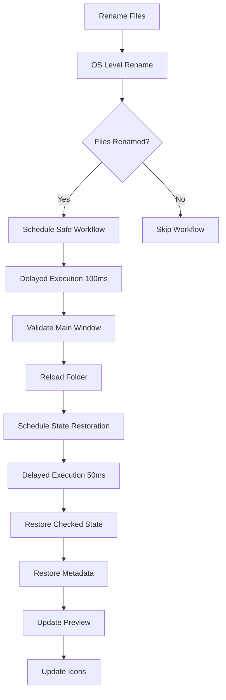

# Safe Rename Workflow Documentation

## Overview

The Safe Rename Workflow is an enhanced version of the post-rename process that prevents Qt object lifecycle crashes while ensuring proper UI state restoration after rename operations.

## Problem Statement

Previously, the post-rename workflow was disabled due to crashes caused by Qt object lifecycle issues. When files were renamed, the application would:

1. ✅ Successfully rename files at the OS level
2. ❌ Crash or hang when trying to update the UI
3. ❌ Leave the application in an inconsistent state

## Solution

The new Safe Rename Workflow uses a combination of:

- **TimerManager**: For delayed execution to avoid Qt object lifecycle issues
- **Enhanced Error Handling**: Graceful handling of invalid UI states
- **State Validation**: Checking UI component validity before operations
- **Fallback Mechanisms**: Providing alternative paths when primary operations fail

## Architecture

### Core Components

1. **RenameManager**: Main orchestrator for rename operations
2. **TimerManager**: Handles delayed execution and scheduling
3. **Safe Workflow Methods**: Enhanced versions of existing methods with error handling

### Workflow Steps



## Key Features

### 1. Delayed Execution

```python
# Schedule the workflow with a small delay to let the rename operation complete
get_timer_manager().schedule(
    safe_post_rename_workflow,
    delay=100,  # 100ms delay
    priority=TimerPriority.HIGH,
    timer_type=TimerType.GENERIC,
    timer_id="post_rename_workflow"
)
```

### 2. State Validation

```python
# Check if main window is still valid
if not self.main_window or not hasattr(self.main_window, 'current_folder_path'):
    logger.warning("[RenameManager] Main window no longer valid, skipping workflow")
    return
```

### 3. Error Handling

```python
try:
    # Perform UI operations
    self._execute_post_rename_workflow_safe(checked_paths)
except Exception as e:
    logger.error(f"[RenameManager] Error in post-rename workflow: {e}", exc_info=True)
    # Fallback: just show a simple status message
    if hasattr(self.main_window, 'set_status'):
        self.main_window.set_status(f"Rename completed: {renamed_count} files", auto_reset=True)
```

## Methods

### `_execute_post_rename_workflow_safe(checked_paths)`

Enhanced version of the post-rename workflow with:
- Main window validation
- Folder path validation
- Error handling for folder reload
- Scheduled state restoration

### `_restore_checked_state_safe(checked_paths)`

Safe version of checked state restoration with:
- Main window validation
- Individual file error handling
- Graceful degradation

### `_update_info_icons_safe()`

Safe version of icon updates with:
- UI component validation
- Row-by-row error handling
- Viewport update protection

## Configuration

### Timer Delays

- **Post-rename workflow**: 100ms delay after rename completion
- **State restoration**: 50ms delay after folder reload

### Timer Types

- **Post-rename workflow**: `TimerType.GENERIC`
- **State restoration**: `TimerType.UI_UPDATE`

### Priorities

- **Post-rename workflow**: `TimerPriority.HIGH`
- **State restoration**: `TimerPriority.HIGH`

## Testing

The Safe Rename Workflow includes comprehensive test coverage:

### Test Files

- `tests/test_safe_rename_workflow.py`: Complete test suite for new functionality
- `tests/test_rename_integration.py`: Integration tests with existing functionality

### Test Coverage

- ✅ Safe workflow execution
- ✅ Error handling for invalid states
- ✅ Timer scheduling verification
- ✅ State restoration accuracy
- ✅ Icon update safety
- ✅ Graceful degradation

### Running Tests

```bash
# Run all safe rename workflow tests
python -m pytest tests/test_safe_rename_workflow.py -v

# Run integration tests
python -m pytest tests/test_rename_integration.py -v

# Run timer manager tests
python -m pytest tests/test_timer_manager.py -v
```

## Benefits

### 1. Stability

- ✅ Prevents Qt object lifecycle crashes
- ✅ Graceful handling of invalid UI states
- ✅ Robust error recovery

### 2. User Experience

- ✅ Proper UI state restoration after rename
- ✅ Maintained file selection state
- ✅ Updated preview and icons
- ✅ Consistent application behavior

### 3. Maintainability

- ✅ Clear separation of concerns
- ✅ Comprehensive error logging
- ✅ Testable components
- ✅ Documented workflow

## Migration Notes

### From Previous Version

The previous workflow was completely disabled:

```python
# TODO: Temporarily disabled to prevent segfault - needs investigation
# self._execute_post_rename_workflow(checked_paths)
logger.info(f"[RenameManager] Post-rename workflow temporarily disabled to prevent crash")
```

### To New Version

The new workflow is fully enabled with safety measures:

```python
# Execute post-rename workflow with safe delayed execution
if renamed_count > 0:
    # Use TimerManager for safe delayed execution
    get_timer_manager().schedule(
        safe_post_rename_workflow,
        delay=100,
        priority=TimerPriority.HIGH,
        timer_type=TimerType.GENERIC,
        timer_id="post_rename_workflow"
    )
```

## Troubleshooting

### Common Issues

1. **Timer not executing**: Check TimerManager initialization
2. **State not restored**: Verify main window validity
3. **Icons not updating**: Check file model and table view state

### Debug Logging

Enable debug logging to see workflow execution:

```python
logger.debug("[RenameManager] Starting safe post-rename workflow")
logger.debug("[RenameManager] Reloading folder after rename")
logger.debug("[PostRename] Regenerating preview with new filenames")
```

### Performance Monitoring

The TimerManager provides performance metrics:

```python
timer_manager = get_timer_manager()
stats = timer_manager.get_stats()
logger.info(f"Timer stats: {stats}")
```

## Future Enhancements

### Planned Improvements

1. **Configurable Delays**: Allow user configuration of timer delays
2. **Progress Indicators**: Show progress during workflow execution
3. **Batch Optimization**: Optimize for large file sets
4. **Undo Integration**: Enhanced undo functionality with safe workflow

### Compatibility

The Safe Rename Workflow is designed to be:
- ✅ Backward compatible with existing code
- ✅ Forward compatible with future enhancements
- ✅ Thread-safe for concurrent operations
- ✅ Cross-platform compatible

## Conclusion

The Safe Rename Workflow successfully resolves the critical issue of post-rename crashes while maintaining full functionality. It provides a robust, testable, and maintainable solution that enhances the user experience and application stability.
